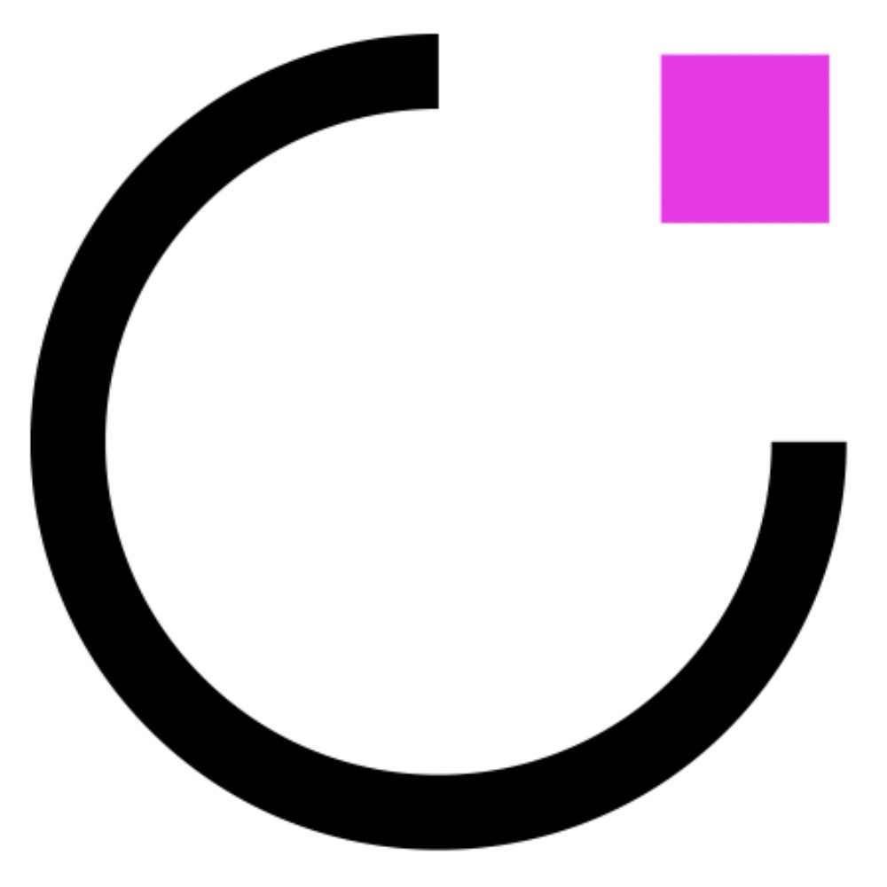

<!--
*** Thanks a lot to Best-README-Template for inspiring this README.
*** If you have a suggestion
*** https://github.com/othneildrew/Best-README-Template
-->

<!-- PROJECT SHIELDS -->
<!--
*** I'm using markdown "reference style" links for readability.
*** Reference links are enclosed in brackets [ ] instead of parentheses ( ).
*** See the bottom of this document for the declaration of the reference variables
*** for contributors-url, forks-url, etc. This is an optional, concise syntax you may use.
*** https://www.markdownguide.org/basic-syntax/#reference-style-links
-->

[![Issues][issues-shield]][issues-url]
[![LinkedIn][linkedin-shield]][linkedin-url]

<!-- PROJECT LOGO -->
 

  

  <h3 align="center">Artpoint</h3>

  

    We are committed to the promotion of digital art.
     
    <a href="https://artpoint.fr"><strong>The web site »</strong></a>
     
     
    <a href="https://artpoint.fr">Join Our Team</a>
    ·
    <a href="https://github.com/ArtPoint-fr/README/issues">Report Bug</a>
    ·
    <a href="https://github.com/ArtPoint-fr/README/issues">Request Feature</a>
  

<!-- ABOUT THE PROJECT -->

## About The Company

[![Product Name Screen Shot][product-screenshot]](https://example.com)

### Our observations

Digital art captivates, fascinates, awakens the senses and develops creativity. As people are increasingly seeking to experience digital art, our wish is to bring this experience to public and private places.

### Our vision

At ART POINT, we aim to increase the opportunities for digital art to meet its audience, to promote artistic creation and democratize access to art. We represent more than 150 international artists with exceptional know-how and offer you the best of their work.

### Our ambition

We enhance your spaces through art. With ART POINT, surprise your customers or your collaborators by integrating real artistic experiences into your space. We seek to put technology at the service of art and make your place unforgettable with a timebound experience!

(<a href="#top">back to top</a>)

### Our tech interests

A short list of technologies we work on.

- [Next.js](https://nextjs.org/)
- [React.js](https://reactjs.org/)
- [GraphQL](https://graphql.org)
- [Ethereum](https://ethereum.org/)

(<a href="#top">back to top</a>)

<!-- CONTACT -->

## Contact

- Instagram: [artpoint.fr](https://www.instagram.com/artpoint.fr/)
- LinkedIn: [Artpoint](https://www.linkedin.com/company/14803199/)
- Twitter: [@Artpoint_Paris](https://twitter.com/Artpoint_Paris)

(<a href="#top">back to top</a>)

<!-- MARKDOWN LINKS & IMAGES -->
<!-- https://www.markdownguide.org/basic-syntax/#reference-style-links -->

[issues-shield]: https://img.shields.io/github/issues/ArtPoint-fr/README.svg?style=for-the-badge
[issues-url]: https://github.com/ArtPoint-fr/README/issues
[linkedin-shield]: https://img.shields.io/badge/-LinkedIn-black.svg?style=for-the-badge&logo=linkedin&colorB=555
[linkedin-url]: https://www.linkedin.com/company/14803199/admin/
[product-screenshot]: images/screenshot.png
